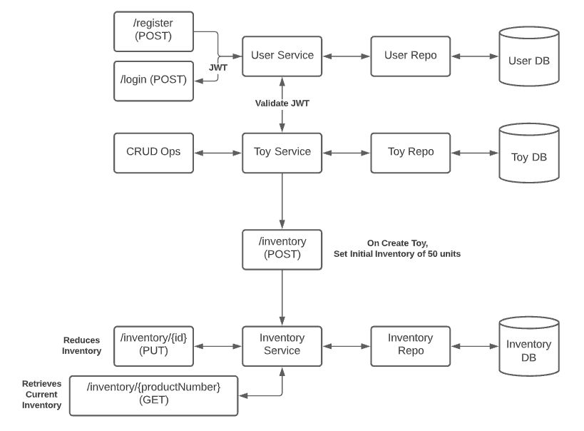

# Hack-a-Thon

In this hack-a-thon, you will use Docker images provided for you to create a set of microservices that enable management of a toyshop's inventory.

## Register new user

POST against http://localhost:5050/register using a request body like this:

{
    "id": 0,
    "name": "Melissa Testing",
    "email": "mtesting@test.com",
    "password": "password123"
}

## Login existing user and get new JWT

POST against http://localhost:5050/login using a request body like this:

{
    "email": "mtesting@test.com",
    "password": "password123"
}

## Toy operations

### Get all toys

GET against http://localhost:5000/auth/toys providing the JWT from login in an "x-access-token" header

### Get toy by ID

GET against http://localhost:5000/auth/toys/{id} providing the JWT from login in an "x-access-token" header

### Create new toy

POST against http://localhost:5000/auth/toys providing the JWT from login in an "x-access-token" header and using a request body like this:

{
    "id": 0,
    "productNumber": "YOYO333",
    "name": "Yo-Yo",
    "description": "Tons o' fun",
    "unitCost": 3.99
}

### Edit an existing toy

PUT against http://localhost:5000/auth/toys/{id} providing the JWT from login in an "x-access-token" header and using a request body like this:

{
    "id": {id},
    "productNumber": "YOYO333",
    "name": "Yo-Yo",
    "description": "Tons o' fun redux",
    "unitCost": 4.99
}

### Delete an existing toy

DELETE against http://localhost:5000/auth/toys/{id} providing the JWT from login in an "x-access-token" header

## Inventory operations

### Get current inventoy for a toy

GET against http://localhost:5100/inventory/{productNumber}. Allows view of inventory to confirm automatically initialized to 50 on creation of a new toy.

## Deploy to Kubernetes

Using images `gamuttechsvcsllc/inventory-svc:1.0`, `gamuttechsvcsllc/toyshop-svc:1.0`, `gamuttechsvcsllc/users-svc:1.0` and the `mysql` image, create manifests to deploy the set of microservices to k8s along with a database. Use Services to enable access to the defined API routes and access to the MySQL database from the services. Use ConfigMaps and Secrets where appropriate for storage and provision of configuration detail. Also, leverage PersistentVolumeClaims where relevant to maintain required data across any Pod replacements.

For `users` service, config currently looks like this:

MYSQL_DATABASE = users_db  
MYSQL_PASSWORD = pass
MYSQL_USERNAME = root
MYSQL_SERVICE_HOST = localhost

For `toyshop` service, config currently looks like this:

MYSQL_DATABASE = toyshop_db  
MYSQL_PASSWORD = pass
MYSQL_USERNAME = root
MYSQL_SERVICE_HOST = localhost

AUTH_ENDPOINT = http://localhost:5050/auth/verify
INV_ENDPOINT = http://localhost:5100/inventory

For `inventory` service, config currently looks like this:

MYSQL_DATABASE = inventory_db  
MYSQL_PASSWORD = pass
MYSQL_USERNAME = root
MYSQL_SERVICE_HOST = localhost